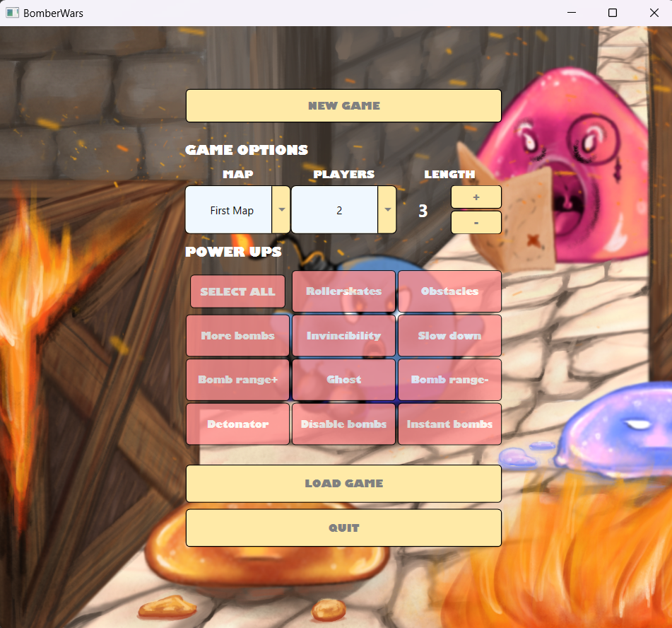
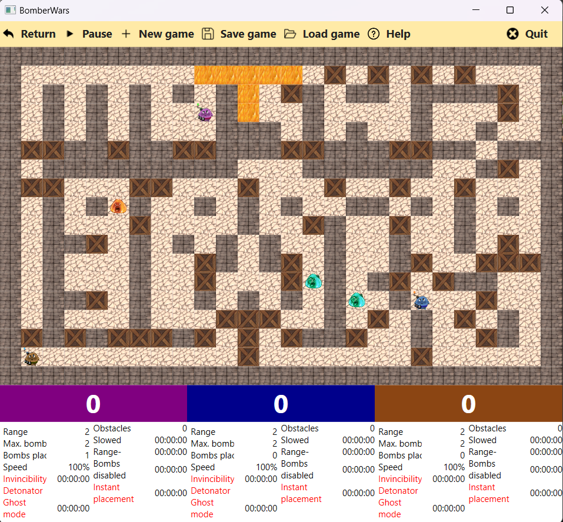
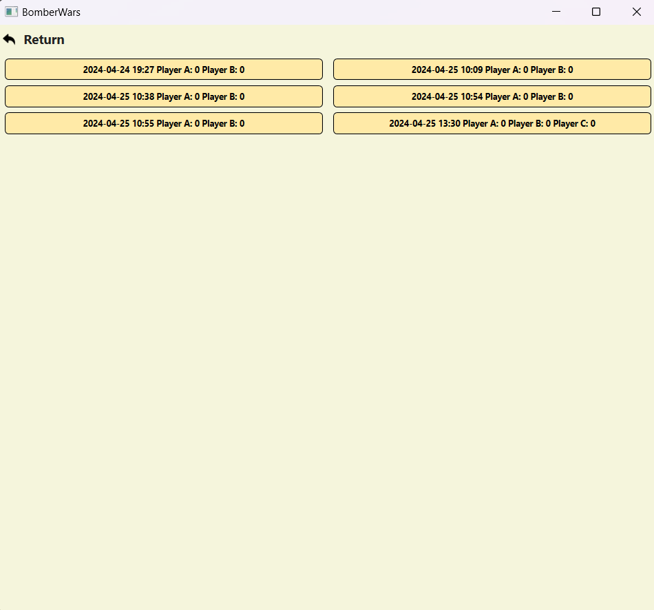
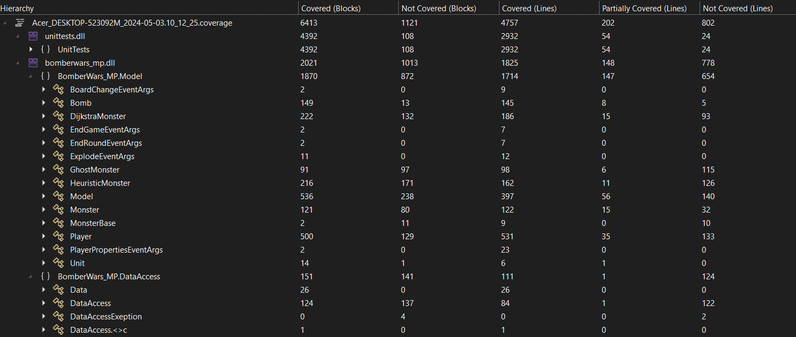

# BomberWars

## Feladat

A játék rövid leírása:
A játék egy 2 dimenziós pályán játszódik, amely négyzet alakú mezőkből áll. A játékot 2 játékos játsza, akiknek 1-1 bomberman figurát irányítva céljuk, hogy egyedüliként maradjanak életben. A játékpálya mezőin fal elemek, dobozok, szörnyek és maguk a játékosok figurái helyezkednek el. A játékosok bombákat lehelyezve felrobbanthatják a dobozokat, szörnyeket és a játékosokat (akár saját magukat is). Egy játékos veszít (és ezáltal ellenfele győz), ha felrobban, vagy ha egy szörny elkapja.

### Falak:
A fal elemek felrobbanthatatlanok, és néhány (a választható részfeladatokban részletezett) kivételtől eltekintve se a játékosok, se a szörnyek nem léphetnek rájuk. A játékpályát fal veszi körül (így arról kilépni nem lehet).

### Játékosok:
A játékosok 1-1 bomberman figurát irányítanak, amelyekkel balra, jobbra, felfele és lefele lehet lépni. Speciális akcióként a játékosok egy bombát is lehelyezhetnek azon mezőre, amelyen állnak. Egy játékosnak egyszerre csak 1 lehelyezett bombája lehet (lásd a Dobozok részt ennek kiegészítéséhez). A játékosok a karakterüket a billenytűzet segítségével irányíthatják

### Bombák:
A lehelyezett bombák egy rövid idő után felrobbanak, és az aktuális mezőn kívül mind a 4 irányba (balra, jobbra, felfele, lefele) 2-2 mező távolságban hatnak. A falak nem felrobbanthatóak és a robbanás nem terjed tovább rajtuk keresztül. A dobozok felrobbanthatóak, de a robbanás erejét megtörik, a robbanás nem terjed tovább rajtuk keresztül. A bombák egymást is az időzítőjük lejárta előtt felrobbantják, így láncreakció jöhet létre. A robbanás ugyan gyorsan terjed, de nem azonnali, tehát a bomba robbanásának pozíciójától a távolsággal arányos módon, kis késleltetéssel fejtse csak ki egy robbanás a hatását a távolabbi mezőkre. A felrobbanó bomba a robbanásban érintett mezőkön lévő játékosokat és szörnyeket elpusztítja. A bombákra néhány (a választható részfeladatokban részletezett) kivételtől eltekintve nem léphetnek rá se a játékosok, se a szörnyek. (A játékosok maguk “alá” helyezik le a bombát, amelyről ilyenkor még leléphetnek, de utána visszalépni az adott mezőre nem tudnak, amíg a bomba ott van.)

### Dobozok:
A dobozok felrobbanthatóak, és néhány (a választható részfeladatokban részletezett) kivételtől eltekintve se a játékosok, se a szörnyek nem léphetnek rájuk. Ha egy doboz felrobbantásra kerül, előkerülhet belőle egy “power-up”, amelyre ha bármely játékos rálép, karaktere bónuszt kap az adott játékra. A lehetséges bónuszok:

Bombák száma: a játékos által lehelyezhető bombák száma 1-gyel növekszik.
Robbanás hatótáva: a játékos bombáinak hatótávja mind a 4 irányba 1-1 mezővel növekszik.

### Szörnyek:
A játékpályán szörnyek is bolyonganak, amelyek bármely játékos karakterével azonos mezőre lépve, a játékos karaktere meghal. Az alapfeladatban a szörnyek egyszerű heurisztikával rendelkezzenek: akadályba ütközéskor véletlenszerűen váltsanak irányt. Néha meglepetésszerűen is változtassanak a haladási irányukon, hogy mozgásuk kevésbé legyen kiszámítható.

### A játék vége:
Amennyiben valamelyik játékos felrobban vagy egy szörny elkapja, a játék még egy rövid ideig (például a bombák időzítésének megfelelő ideig) folytatódjon. Ha ezen idő alatt a másik játékos életben tud maradni, akkor megnyerte a játszmát. Ha a másik játékos is meghal ezen idő alatt, akkor a játék döntetlen eredménnyel végződik.

### A játék indítása:
Új játék indításakor választhassunk legalább 3, előre elkészített, különböző pálya közül. Az egyes pályákon a falak és a dobozok pozíciója előre definiált lehet, azonban az, hogy mely dobozok rejtenek bónuszt (és milyet), az dinamikusan, futási időben eldöntött legyen. A pályák alapterülete lehet téglalap, de más alakzatú is. Adhassuk azt is meg, hogy a játékot hány megnyert játszmáig szeretnénk folytatni. Minden játszma után kerüljön megjelenítésre az aktuális játék eredménye, továbbá, hogy melyik játékos hány nyert játszmánál tart. (A döntetlen mindkét játékos szempontjából vereségnek számít.) Az utolsó játék után a végeredményt is jelenítsük meg.

## Részfeladatok
- Intelligens szörnyek (1)
- Haladó bónuszok (1)
- Hátráltató bónuszok (0.5)
- Perzisztencia (1)
- Három játékos (1)

## Karakterek mozgatása

### 1. játékos
- mozgás: WASD
- bomba lerakás: Q
- boma detonálása: E
- akadály lerakása: R

### 2. játékos
- mozgás: IJKL
- bomba lerakás: U
- boma detonálása: O 
- akadály lerakása: P

### 3. játékos
- mozgás: numpad 8456
- bomba lerakás: numpad 7
- boma detonálása: numpad 8
- akadály lerakása: numpad +

## Játék bemutatása

### Kezdőképernyő

### Játék képernyő

### Betöltő képernyő

## CI/CD

- Code coverage: 

## Felhasznált szoftverek:
AutoClosingMessageBox: https://github.com/DmitryGaravsky/AutoClosingMessageBox

## Fehasznált textúrák, asset-ek

Mind saját készítésűek.
